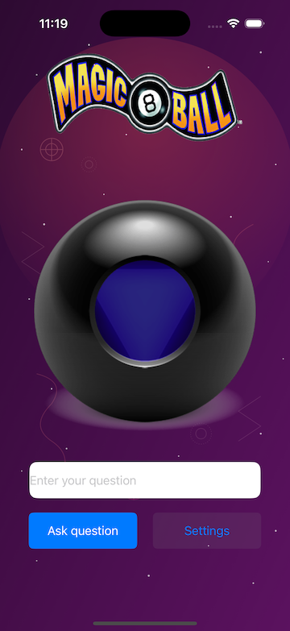
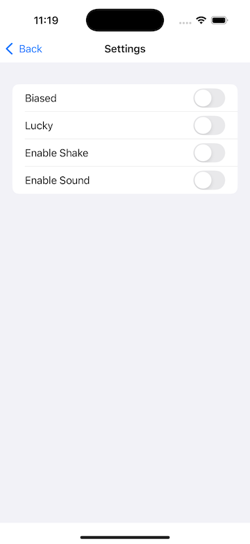

# 🎱 Magic 8 Ball

A fun iOS app that brings the classic Magic 8 Ball experience to your phone—powered by an API to give you randomized answers with a tap.

---

## 📱 Screenshot

 

---

## ✨ Features

- 🎤 Ask any yes/no question and shake (or tap) for an answer
- 🔮 Gets responses from a Magic 8 Ball API
- 🧼 Smooth UIKit animations and interactions
- 📡 Internet-based randomness, not just hardcoded replies

---

## 🛠 Built With

- [Swift 5](https://swift.org/)
- [UIKit](https://developer.apple.com/documentation/uikit)
- [URLSession](https://developer.apple.com/documentation/foundation/urlsession)
- Xcode 15+

---

## 🚀 Getting Started

### Prerequisites

- iOS 15+
- Xcode 15+

### Installation

1. Clone the repo:
   ```bash
   git clone https://github.com/randyvarela5/Magic8Ball.git
